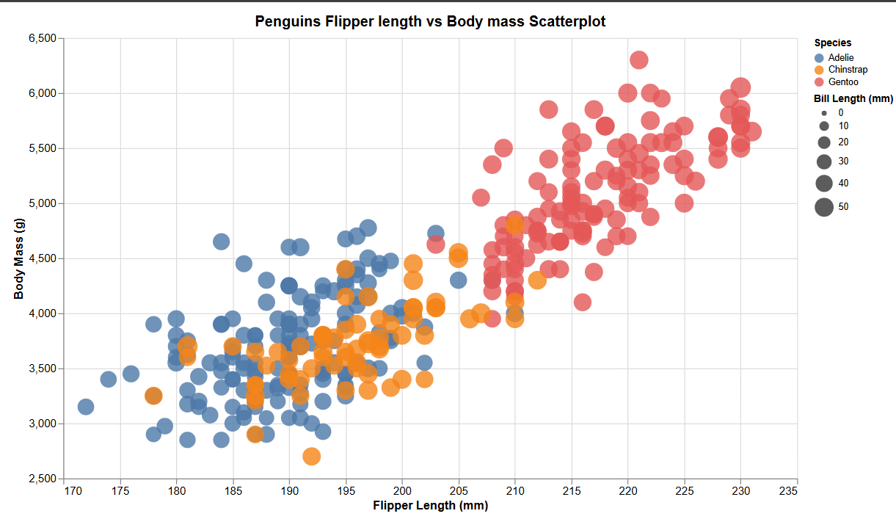
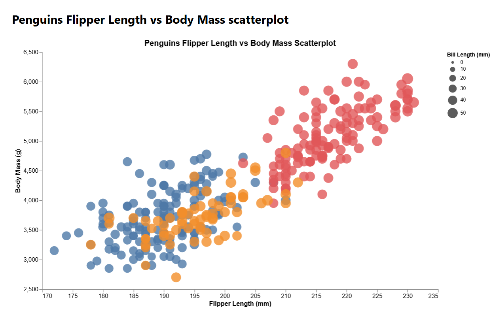

# Excel

For the Excel visualization, I created the scatterplot using a bubble chart, mapping flipper length to the x-axis and body mass to the y-axis. The color was used to distinguish penguin species, while bubble size represented bill length. Excel made it very easy to quickly construct the chart and manually adjust axis ranges, labels, and transparency to match the reference visualization. What made it difficult and the hack I had use was that Excel does not automatically support mapping categorical values to color within a single bubble series, so I had to manually split the dataset into separate series by species in order to achieve the correct color encoding. This workaround show's Excel's limitations for its scalabilty, but it also allows for a quick prototype when the data is small.

# Tableau

For the Tableau visualization, I created the scatterplot by mapping flipper length to the x-axis and body mass to the y-axis, with each point representing an individual penguin. Species was added using color and bill length was mapped to the size, which Tableau was able to handle naturally through its drag-and-drop feature. Tableau made it very easy to apply multiple visual encodings simultaneously without requiring any manual data manipulation or workarounds, and adjusting axis ranges, legends, and opacity was very easy. I didn't really need to use and hacks or workarounds to get it to work properly. Compared to Excel, Tableau felt more easy and scalable for data analysis, especially when working with categorical color mappings and continuous size encodings. 

# d3

**important** run python -m http.server 8000 and then enter localhost:8000/d3 on your web browser

For the D3 visualization, I created the scatterplot entirely from scratch using js, which required explicitly defining scales, axes, and visual encodings for the data. Flipper length and body mass were mapped to the x- and y-axes, species was coded using color, and bill length was represented through size, with opacity at 0.8. Compared to Excel and Tableau, D3 required a lot more setup and attention to detail, especially when manually constructing axes, gridlines, and scales that do not start at zero. While this made the process a lot more difficult to do, it also provided the greatest level of control over the final appearance and behavior of the visualization. D3 would be especially useful in future projects that require custom interactions, precise visual styling, or highly tailored visualizations that are not easily achievable with higher-level tools. Also, to help me create this whole thing, I followed the d3 website's information related to creating scatterplots, it helped me significantly especially when adding things like custom axis and size represenations: https://d3-graph-gallery.com/graph/custom_theme.html.

# Altair

**important** run python plot_altair.py, and then go to the file location of altair_penguins.html and open it in chrome by double clicking the file

For the Altair visualization, I created the scatterplot Altair lib in python, mapping flipper length to the x-axis and body mass to the y-axis. Species was encoded using color, bill length was mapped to the size of each point, and opacity was set to approximately 0.8 to match the reference visualization. Unlike Excel and Tableau, Altair required me to explicitly define each visual encoding in code, but it still remained easier to do compared to D3. One challenge I encountered was that Altair’s default size scaling caused the bill length encoding to overpower the visualization, so I had to manually adjust the size scale range to keep the points readable and properly balanced. Overall, Altair provided a strong middle ground between ease of use and control, making it well-suited code-based visualizations that are cleaner and more flexible than spreadsheet tools but less verbose than low-level libraries like D3. To help me learn how to construct this scatterplot using Altair, I followed this geekforgeek tutorial on how to map quantitative variables to position, color, and size in an easy to understand way: https://www.geeksforgeeks.org/python/python-altair-scatter-plot/.

# Vega-lite

**important** run python -m http.server 8000 and then enter localhost:8000 on your web browser 

For the Vega-Lite visualization, I created the scatterplot using a declarative JSON specification, mapping flipper length to the x-axis and body mass to the y-axis. Species was encoded using color, bill length was mapped to point size, and opacity was set to approximately 0.8 to match the reference visualization. Unlike Altair, which provides a Python interface, Vega-Lite required me to directly define the visualization grammar in JSON, explicitly specifying the data source, transformations, and visual encodings. One challenge I encountered was fine-tuning the visual appearance, such as removing grid lines, hiding the legend, and adjusting the color palette to make the chart cleaner and less cluttered. While Vega-Lite is higher-level than D3, it still offers strong control over layout and styling through its declarative syntax. Overall, Vega-Lite was effective for creating a clean, reproducible visualization with minimal code, making it well-suited for cases where clarity and consistency are more important than custom interactivity.

# Technical Achievements

In Excel and Tableau, I focused on understanding how high-level tools handle visual encodings such as color, size, and axis scaling with minimal code. In D3, Altair, and Vega-Lite, I worked directly with code-based libraries, which required explicitly defining scales, encodings, and transformations rather than relying on defaults. Several visualizations include interactivity, such as tooltips that display detailed information when hovering over individual points in D3, Altair, and Vega-Lite. I also ensured that all visualizations used non-zero-based scales, controlled opacity, and consistent mappings for color and size to meet the assignment requirements. In particular, the library-based visualizations (D3, Altair, and Vega-Lite) demonstrate interactive techniques such as hover tooltips and explicit scale control that are not easily achievable in spreadsheet-based tools.

# Design Achievements

From a design perspective, I aimed to maintain consistent visual encodings across all five visualizations so that comparisons between tools were meaningful. Species was consistently represented using color, bill length was mapped to point size, and opacity was used to reduce overplotting. I also paid attention to axis ranges, spacing, and background cleanliness to ensure the data was easy to read. As I moved from tools like Excel and Tableau to libraries such as D3, Altair, and Vega-Lite, I gained more control over aesthetic decisions, including custom color palettes, legend visibility, and element sizing. For example, in the Vega-Lite visualization, I removed grid lines and legends to reduce clutter and adjusted the color palette to improve visual clarity. These design decisions helped create cleaner, more readable scatterplots while still accurately representing the underlying data. I intentionally matched the species color scheme (Adelie = blue, Chinstrap = orange, Gentoo = red) across Tableau, D3, Altair, and Vega-Lite to ensure visual consistency and make cross-tool comparisons easier.
